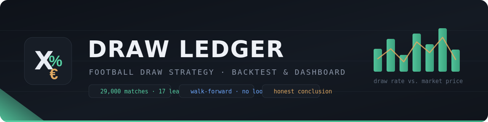

# Draw Ledger — Football Draw Strategy Backtest & Dashboard

**[▶ Live demo](https://bakidiskostas.github.io/draw-strategy-backtest/)**

A research tool that backtests draw-betting strategies (including the martingale
system) against real historical football results and closing odds, and generates a
self-contained interactive HTML dashboard. Built to answer one question honestly:
**does any of this actually work?**

Data comes from [football-data.co.uk](https://www.football-data.co.uk/) (free, public
CSVs) and — for upcoming Argentina/Brazil fixtures — the free tier of
[The Odds API](https://the-odds-api.com/).

---

## ⚠️ This is not betting advice

**Read this before anything else.**

- This is an **analysis and education tool**, not a tipster and not a system to make
  money. Nothing here is financial or betting advice.
- **Betting has a negative expected value.** Over time, the bookmaker's margin means
  the average bettor loses. This project's own backtest demonstrates exactly that.
- The **martingale** system (doubling after a loss) does not change the expected
  value. It trades a steady trickle of small wins for rare, catastrophic losses.
- **Gambling can be addictive** and can lead to serious financial and personal harm.
  If you bet at all, only ever stake money you can afford to lose entirely.

### Where to get help

- **Germany** — BIÖG (formerly BZgA) free, anonymous helpline: **0800 137 27 00** ·
  [check-dein-spiel.de](https://www.check-dein-spiel.de/)
- **International (English)** — [GamCare](https://www.gamcare.org.uk/) ·
  [BeGambleAware](https://www.begambleaware.org/) ·
  [Gamblers Anonymous](https://www.gamblersanonymous.org/)

If betting stops feeling like a hobby and starts feeling like a need, please reach
out to one of the services above.

---

## What this project demonstrates

A self-contained data pipeline and analysis tool, end to end:

- **Data engineering** — downloads and merges ~29,000 matches across 17 leagues from
  two different CSV schemas, with caching and graceful failure handling.
- **Correct methodology** — walk-forward simulation with no look-ahead bias; rolling
  team form computed only from matches *before* each fixture.
- **Honest evaluation** — market-efficiency check (computed bookmaker margin),
  risk-adjusted metrics (return on capital), per-league breakdown as an out-of-sample
  sanity check, and a conclusion that rejects the strategy rather than overselling it.
- **API integration** — live odds via a REST API, with the key kept out of source.
- **CI/CD + front end** — a GitHub Actions workflow rebuilds the dashboard and
  publishes it to GitHub Pages on demand (one click, also from the phone).

## Key finding

Across ~29,000 matches from Europe's top and second divisions plus Argentina and
Brazil, the market is efficient: Bet365's margin is ~6%, and its de-vigged implied
draw probability sits within a fraction of a percent of the actual draw rate. Any
apparent profit in the filtered buckets comes from **match selection**, not from the
staking system — and flat betting captures it with a fraction of the drawdown and
**zero bust risk**. The martingale adds only risk. The small edge that does appear is
league-dependent, on small samples with selection bias, and does not survive as a
consistent, scalable effect. In short: the data says what betting math always says.

## What it does

Given the leagues/seasons and a set of draw-rate thresholds, the script:

1. **Downloads** results + closing odds (cached locally, so it only downloads once).
2. Computes each team's **rolling 6-month draw rate** *before* each match — no
   look-ahead bias.
3. **Filters** matches where the two teams' average draw rate clears a threshold
   (40/45/50%, configurable), keeping only the higher-rated fixture when two
   candidates kick off at the same time.
4. **Simulates** three staking systems walk-forward on real closing odds:
   - `flat` — constant EUR 1 stake (the honest baseline)
   - `recovery` — martingale sized to recover accumulated losses + a profit target
   - `double` — classic doubling (1-2-4-8-...)
   ...across several bust thresholds (8-12 consecutive losses = a blow-up).
5. Runs a **market-efficiency diagnostic**: the actual draw rate vs. the market's
   implied probability, plus Bet365's computed margin (overround).
6. Finds **upcoming candidate fixtures** (football-data.co.uk fixtures + Argentina/
   Brazil via The Odds API) and a **stake calculator** for each system.
7. Writes a self-contained **`dashboard.html`** with per-league filtering, a bust
   selector, risk-adjusted metrics, and a click-to-inspect "draws by attempt" view.

## Install

```bash
pip install -r requirements.txt
```

Requires Python 3.10+.

## Usage

```bash
# default run: 17 leagues, 5 seasons, thresholds 40/45/50
python martingale_backtest.py

# customise
python martingale_backtest.py --thresholds 40 45 50 --targets 5 10 15 20 25
python martingale_backtest.py --leagues I2 SP2 F2 ARG BRA --seasons 2324 2425 2526
python martingale_backtest.py --max-steps 8 9 10 11 12
python martingale_backtest.py --mode flat
python martingale_backtest.py --list-leagues
```

Outputs: `backtest_results.csv` and `dashboard.html` in the working directory.
`dashboard_template.py` must sit next to `martingale_backtest.py` — the main script
imports the HTML template from it.

## Options

| Flag | Default | Meaning |
|------|---------|---------|
| `--leagues` | 17 leagues (see `--list-leagues`) | which leagues to include |
| `--seasons` | 2122 ... 2526 | seasons, football-data.co.uk format |
| `--thresholds` | 40 45 50 | draw-rate cutoffs (%) |
| `--targets` | 5 10 15 20 25 | recovery profit targets (EUR) |
| `--mode` | both | `flat`, `recovery`, `double`, or `both` |
| `--max-steps` | 8 9 10 11 12 | consecutive losses that count as a bust |

## Reading the dashboard

- **Section 01 — market efficiency:** actual draw rate vs. the market's implied
  probability, with Bet365's margin. If they nearly coincide, the market is efficient.
- **Section 02-03 — upcoming candidates + stake calculator:** the next qualifying
  fixtures with the best available draw odds, and how much each system would stake
  (with an editable odds field for the price you can actually get).
- **Section 05 — by league:** matches and candidates per league — a poor-man's
  out-of-sample test of where any edge concentrates.
- **Section 06 — backtest:** filter by league and bust length. Key columns:
  - `real_draw_%` vs `avg_odds` — actual draw rate vs. implied probability.
  - `P&L/Cap` — return on the capital you had to risk (the honest, risk-adjusted view).
  - `avg bust`, `min bal`, `worst run`, `follow` — how bad the bad case gets.
  - **Click any row** to see the *draws-by-attempt* distribution (how many draws came
    on the 1st bet, 2nd, ..., worst streak) and the capital needed to follow the worst
    streak to its win.

## Optional: Argentina & Brazil upcoming games

football-data.co.uk's fixtures feed does not cover the extra leagues, so upcoming
Argentina/Brazil matches (with draw odds) come from
[The Odds API](https://the-odds-api.com) — free (500 requests/month, no card),
~2 requests per run.

1. Get a free key at https://the-odds-api.com (email only).
2. Either set an environment variable `ODDS_API_KEY`, or create a file `odds_key.txt`
   next to the script with the key as its only line. Both are git-ignored, so the key
   is never committed.
3. Run as usual. Without a key, everything else works; only the Argentina/Brazil
   upcoming picks are skipped.

## Live dashboard (GitHub Pages)

A GitHub Actions workflow (`.github/workflows/dashboard.yml`) rebuilds the dashboard
and deploys it to GitHub Pages. Trigger it manually from **Actions -> Build dashboard
-> Run workflow** (also available from the GitHub mobile app). Set `ODDS_API_KEY` as a
repository secret so the live build can fetch Argentina/Brazil fixtures.

## Data & attribution

Bet365 and other bookmaker names are trademarks of their respective owners. This is an
independent research project, not affiliated with or endorsed by any bookmaker or data
provider. Match data and odds belong to
[football-data.co.uk](https://www.football-data.co.uk/) and The Odds API; this project
does not redistribute their data — it is downloaded at runtime and is git-ignored.

## License

MIT — see [LICENSE](LICENSE). Covers the source code only, not the data.
